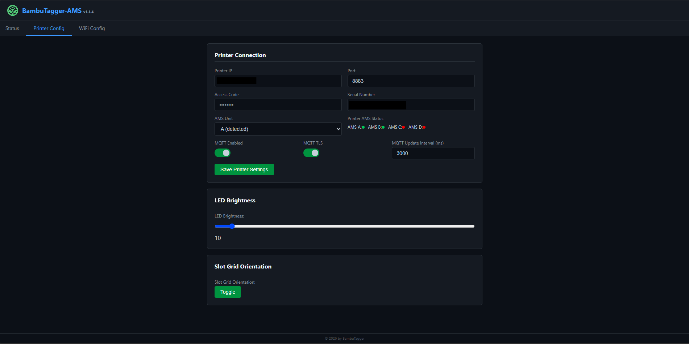
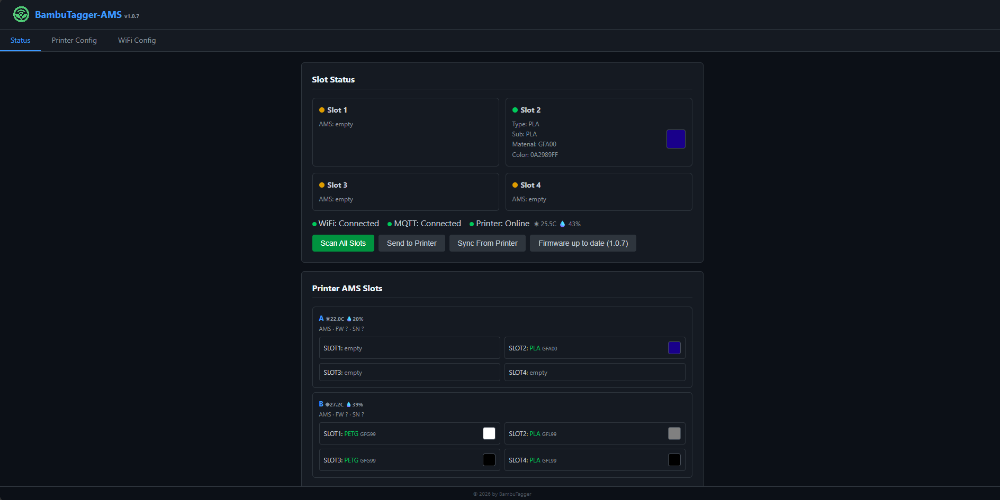
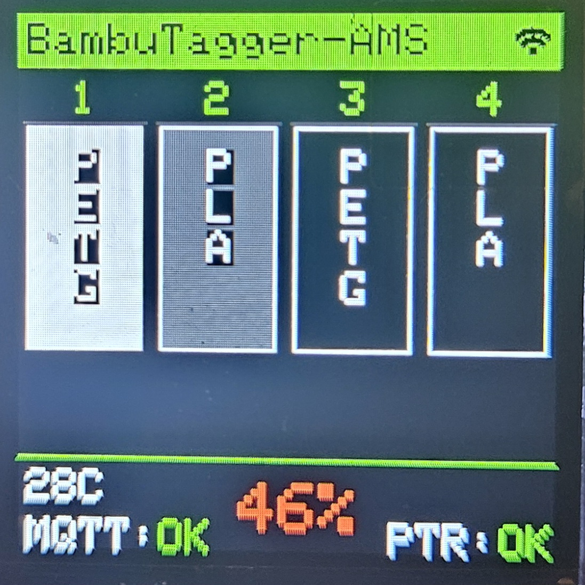
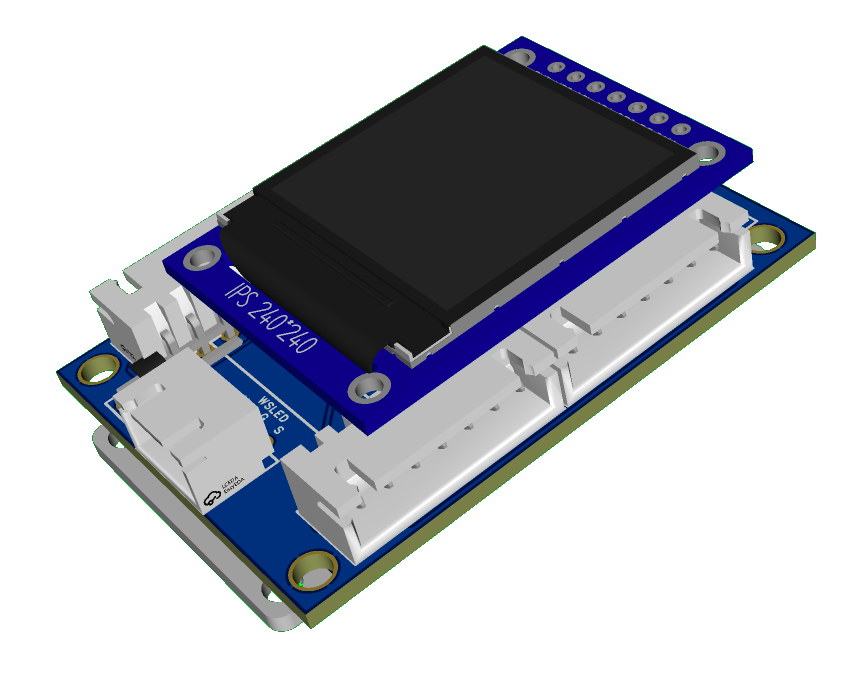

#  BambuTagger-AMS-C

Multi-spool NFC tag reader for Bambu Lab printers. Reads 4 Bambu Lab filament spool tags via RC522, displays live printer AMS tray data over MQTT, and sends RFID tag data to the printer/BMCU. Fully configurable via web interface with automatic AP fallback and OTA firmware updates.

[](https://ko-fi.com/G8M220JASY)

<p align="center">




</p>

---

## Features

| Category | Details |
|----------|---------|
| **RFID** | 4x RC522 on shared SPI bus; MIFARE Classic 1K (Bambu Lab) + NTAG (SpoolEase/TigerTag/OpenTag3D/OpenSpool) auto-detection |
| **Key derivation** | HKDF-SHA256 with Bambu Lab salt — no hardcoded keys |
| **Tag parsers** | TigerTag v2.1 binary, OpenTag3D MIME binary, OpenSpool JSON, SpoolEase NDEF URI, nested NDEF recursion |
| **Live AMS sync** | Reads tray data (material, color, type) from printer over MQTT |
| **BMCU support** | Sends `ams_filament_setting` with correct `tray_type`, `tray_color`, `nozzle_temp_min/max` |
| **TFT display** | 240×240 1.3" ST7789VW with boot splash, live AMS tray data, OTA progress, BME280 temp/humidity |
| **LEDs** | 4x WS2812 addressable LEDs with per-slot color from printer AMS tray data |
| **Web UI** | 3-tab SPA: Status (merged slots + color swatches), Printer Config, WiFi Config |
| **MQTT bridge** | Subscribes to printer status, publishes `ams_filament_setting` commands |
| **WiFi** | Auto-STA on boot; AP fallback `192.168.4.1` with captive portal |
| **OTA updates** | One-click firmware update from GitHub Releases with TFT progress bar |
| **CI/CD** | GitHub Actions: build on commit, release on version tags |

---

## Hardware

### Bill of Materials

| Component | Notes | Buy |
|-----------|-------|-----
| **ESP32** Dev Module | Base board | https://de.aliexpress.com/item/1005006589341221.html |
| **4x RC522** RFID/NFC readers | SPI interface, shared bus | https://de.aliexpress.com/item/1005006233005745.html |
| **4x WS2812** addressable LEDs | Daisy-chained, single data pin | https://de.aliexpress.com/item/32560280169.html |
| **240×240 1.3" TFT** | ST7789VW SPI display | https://www.aliexpress.com/item/1005007094147766.html |
| **BME280** sensor | Temperature/humidity, I2C | https://de.aliexpress.com/item/1005006824236173.html |
| **PCB** | DIY PCB from JLPCB<br/>only > v1.2 | https://oshwlab.com/bambutagger/project_hdkkdlsn |

### Pin Assignments

**SPI Bus (shared by all RC522 readers)**

| Signal | GPIO |
|--------|------|
| MOSI | 23 |
| MISO | 19 |
| SCK | 18 |

**RC522 Readers**

| Reader | SS Pin | RST Pin | Slot | WS2812 Pixel |
|--------|--------|---------|------|--------------|
| #1 | 13 | 26 | 1 | 0 |
| #2 | 12 | 25 | 2 | 1 |
| #3 | 14 | 33 | 3 | 2 |
| #4 | 27 | 32 | 4 | 3 |

**TFT Display (ST7789VW SPI)**

| Signal | GPIO |
|--------|------|
| SDA (MOSI) | 17 |
| SCL (SCK) | 16 |
| DC | 4 |
| RES | 5 |
| BLK (Backlight) | 2 |

**WS2812 LEDs**

| Signal | GPIO |
|--------|------|
| Data | 15 |

**BME280**

| Signal | GPIO |
|--------|------|
| SCL | 21 |
| SDA | 22 |

---

## Software

### Required Libraries (Arduino Library Manager)

| Library | Version | Notes |
|---------|---------|-------|
| `MFRC522-spi-i2c-uart-async` | latest | Multi-reader SPI sharing (not standard MFRC522) |
| `Adafruit NeoPixel` | ≥ 1.12 | WS2812 LED control |
| `Adafruit GFX Library` | ≥ 1.11 | Graphics primitives |
| `Adafruit ST7735 and ST7789 Library` | ≥ 1.10 | TFT display driver |
| `PubSubClient` | ≥ 2.8 | MQTT client |
| `ArduinoJson` | ≥ 6.x or 7.x | JSON parsing |
| `Adafruit BME280 Library` | latest | Temperature/humidity sensor |
| `mbedTLS` | Built-in | HKDF-SHA256 key derivation |

### Board Settings (Arduino IDE)

| Setting | Value |
|---------|-------|
| Board | **ESP32 Dev Module** |
| Flash Size | **4 MB** |
| Partition Scheme | **Default 4MB with spiffs** |
| Upload Speed | 921600 |
| Monitor Speed | **115200** |

### Building

1. Install **ESP32 board package** (≥ 3.x):  
   File → Preferences → Additional Board Manager URLs:  
   `https://espressif.github.io/arduino-esp32/package_esp32_index.json`
2. Install libraries listed above via **Tools → Manage Libraries**.
3. Open `BambuTagger-AMS-C.ino`, select **ESP32 Dev Module**, and upload.

---

## WiFi & AP Mode

| Scenario | Behavior |
|----------|----------|
| No WiFi configured | Opens AP immediately |
| WiFi connection fails | Opens AP after 15 seconds |
| AP active, credentials exist | Retries STA connection every 30 seconds |
| STA connects while AP active | Closes AP, switches to normal mode |

**AP Details:**
- **SSID**: Device name (default: `BambuTagger-AMS`)
- **Security**: Open (no password)
- **IP**: `192.168.4.1`
- **Captive portal**: DNS redirects all domains to the config page

---

## Web Interface

Open a browser to the ESP32's IP (shown on TFT), or `http://192.168.4.1` in AP mode.

| Tab | Description |
|-----|-------------|
| **Status** | Merged slot status with AMS data + scanned tag data, color swatches, printer AMS cards, OTA button |
| **Printer Config** | Printer IP, Port (8883), Access Code, Serial Number, AMS Unit selector (A/B/C/D), MQTT settings |
| **WiFi Config** | SSID, Password, Device Name |

---

## TFT Display (240×240 1.3" ST7789VW)

```
┌────────────────────────────────────────┐
│ Device Name                      WiFi  │  ← status bar (white bg)
├────────────────────────────────────────┤
│ 1: PLA          [■] #C0C0C0FF   100%   │  ← color swatch + percentage
│ 2: empty                               │
│ 3: empty                               │
│ 4: empty                               │
├────────────────────────────────────────┤
│ 22C        45%                         │  ← BME280 (orange/blue)
│ MQTT:OK                         PTR:OK │  ← status line
└────────────────────────────────────────┘
```

OTA progress shown on TFT with header/footer preserved:  
"OTA Update" → "Downloading..." → "Flashing... 45%" → auto-reboot

---

## Printer Communication

### Subscribe

- **Topic**: `device/<serial>/report`
- **Data**: `push_status` (periodic, ~3KB), `get_version` responses

### Publish

- **Topic**: `device/<serial>/request`

**`ams_filament_setting`** structure:

```json
{
  "print": {
    "sequence_id": "0",
    "command": "ams_filament_setting",
    "ams_id": 0,
    "tray_id": 0,
    "tray_info_idx": "GFA00",
    "tray_color": "RRGGBBFF",
    "nozzle_temp_min": 190,
    "nozzle_temp_max": 230,
    "tray_type": "PLA"
  }
}
```

- `tray_type` derived from filament index prefix (GFA→PLA, GFG→PETG, etc.)
- `tray_color` forced to RRGGBBFF format
- `nozzle_temp_min/max` from tag block 6

---

## Tag Format & Reading

### Supported Tag Types

| Tag Type | Format | Example |
|----------|--------|---------|
| **Bambu Lab** | MIFARE Classic 1K | `Bambu - PLA · C12E1FFF · 1000g/1000g` |
| **SpoolEase** | NTAG, NDEF URI | `SpoolEase - PLA · 000000FF · 1000g/1036g` |
| **TigerTag** | NTAG, binary v2.1 | `TigerTag - ASA-AF · F078B4FF · 1000g/1000g` |
| **OpenSpool** | NTAG, NDEF JSON | `OpenSpool - ASA-AF · F078B4FF · 1000g/1000g` |
| **OpenTag3D** | NTAG, MIME binary | `OpenTag3D - ASA-AF · F078B4FF · 1000g/1000g` |

### Bambu Lab (MIFARE Classic 1K)

| Block | Content |
|-------|---------|
| 0 | UID (4 bytes) |
| 1 | Variant ID + Material index (e.g. "GFA00") |
| 2 | Filament type short name |
| 4 | Detailed type string (e.g. "PLA Basic") |
| 5 | RGBA color (bytes 0-3) + spool weight LE (bytes 4-5) |
| 6 | Nozzle temps (bytes 8-11 LE) |

### SpoolEase (NTAG, NDEF URI)

URL format: `https://tag.spoolease.io/S1/?TG=...&M=PLA&CC=000000FF&SC=GFL99&WL=1000&WE=179&WF=1215&NN=190&NX=240`

| Param | Field | Description |
|-------|-------|-------------|
| `M=` | display type | e.g. "PLA", "PETG" |
| `SC=` | `materialType` | Bambu index for MQTT (e.g. "GFL99") |
| `CC=` | `colorHex` | RGBA hex (e.g. "000000FF") |
| `B=` | `manufacturer` | Brand name (e.g. "Jayo") |
| `WL=` | `remainingGrams` | Remaining filament weight |
| `WE=` | empty spool | Empty spool weight |
| `WF=` | full spool | `totalGrams = WF - WE` |
| `NN=` | `nozzleTempMin` | Min nozzle temp °C |
| `NX=` | `nozzleTempMax` | Max nozzle temp °C |

### TigerTag (NTAG, binary v2.1)

| Offset | Size | Field |
|--------|------|-------|
| +0 | 4 | ID TigerTag magic (0x5BF59264/0xBC0FCB97/0x6C41A2E1) |
| +4 | 4 | Product ID |
| +8 | 2 | Material ID → lookup table (PLA/PETG/ABS/TPU...) |
| +14 | 2 | Brand ID |
| +16 | 4 | Color 1 RGBA |
| +20 | 3 | Measure (u24 BE) |
| +24 | 2 | Nozzle Temp Min |
| +26 | 2 | Nozzle Temp Max |
| +76 | 3 | Measure Available |

Known material IDs: PLA=38219, PETG=38256, ABS=20562, etc.

### Authentication & Reading

- **Tag auto-detect**: SAK-based type detection (MIFARE 1K vs NTAG)
- **HKDF-SHA256** derives 16 per-sector Key A/B from 4-byte UID
- Bambu KDF salt/info vectors from reverse-engineered firmware
- Falls back to default key `0xFF...FF` for blank sectors
- Failed auth re-wakes tag via antenna power-cycle
- Dead readers auto-skipped (version register 0x92/0x91/0xB2 check)
- SPI: 1 MHz via `MFRC522_SPI`
- NTAG: page-level reads (page+=4, 4 pages per MIFARE_Read)

### Filament Type Mapping

| Prefix | Type |
|--------|------|
| GFA-GFE, GFL | PLA |
| GFG | PETG |
| GFH, GFI | ABS |
| GFJ | ASA |
| GFK | TPU |

---

## OTA Updates

- **Button**: "Update Firmware" on Status page (shows "Update to vX.Y.Z" or "up to date")
- **Overlay**: full-screen progress overlay with spinner, status text, progress bar
- **Endpoint**: `POST /api/ota` triggers update, `GET /api/ota-check` checks for newer version
- Downloads latest `.ino.bin` from GitHub Releases, flashes via `Update.h`
- 3 retry attempts with 5s stall detection, fresh HTTP client per attempt
- TFT shows "Checking version..." → "Downloading..." → "Flashing..." with percentage
- Device auto-reboots after successful flash, web UI auto-reloads

---

## CI / CD

Workflow at `GHActions/release.yml`:

- **On push/PR**: compiles sketch, uploads artifacts
- **On release tag**: creates merged flash binary + OTA binary, attaches to GitHub Release
- Arduino cache for fast rebuilds, pinned esp32:esp32@3.0.7 core

---

## Configuration Defaults

| Setting | Default |
|---------|---------|
| WiFi SSID | (empty) |
| WiFi Password | (empty) |
| Device Name | BambuTagger-AMS |
| Printer IP | 192.168.1.100 |
| Printer Port | 8883 |
| Access Code | (empty) |
| Printer Serial | (empty) |
| AMS Unit | A (0) |
| MQTT Enabled | Yes |
| MQTT TLS | No |
| MQTT Update Interval | 3000 ms |
| RFID Poll Interval | 100 ms |
| Firmware Version | 1.0.8 |

---

## Credits & References

- [RFID-Tag-Guide](https://github.com/Bambu-Research-Group/RFID-Tag-Guide)
- Display library: [Adafruit ST7735/ST7789](https://github.com/adafruit/Adafruit-ST7735-Library)
- RFID library: [MFRC522-spi-i2c-uart-async](https://github.com/miguelbalboa/rfid)
- OpenTag3D spec: [opentag3d.info](https://opentag3d.info)

---

## License

This project is provided as-is for personal and educational use.  
Bambu Lab trademarks and spool tag data formats are the property of Bambu Lab.
